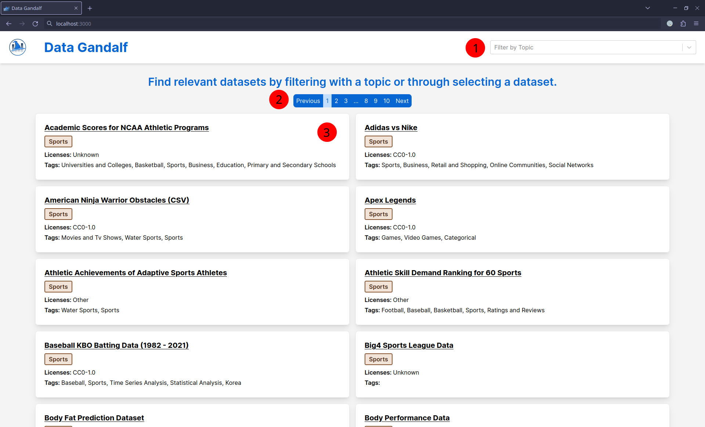
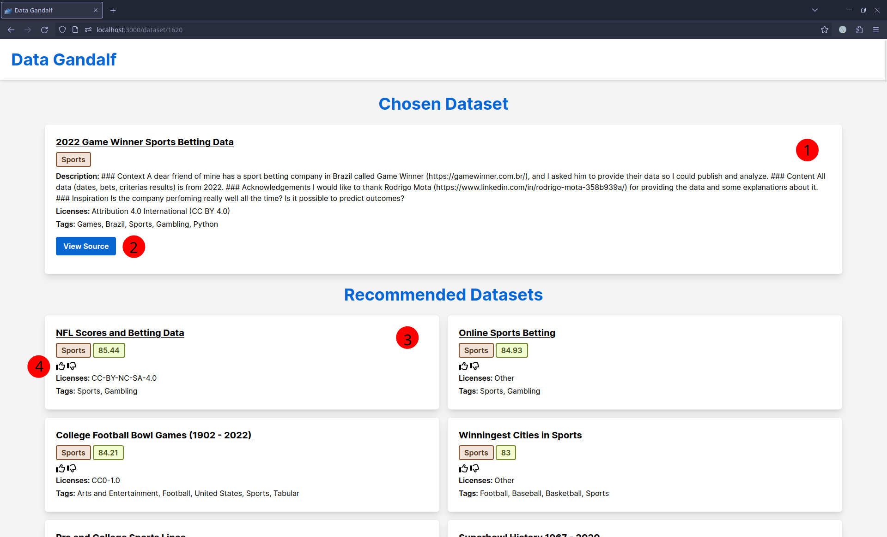

# Data Gandalf's User Manual

Data Gandalf is a dataset recommendation engine that utilizes the TF-IDF algorithm under the hood. It's goal is to provide relevant dataset recommendations to the end user based on a selected dataset.

## Accessing the Web Application

Accessing Data Gandalf is straightforward. Open up your browser of choice, and navigate to the URL where Data Gandalf is hosted. Local instances can be accessed at [localhost:3000](localhost:3000). The URL of hosted instances can vary, so it is recommended to contact your system administrator or IT department for a specific URL.

## The Home Page

On the home page for Data Gandalf, users are able to browse through all the different datasets that are loaded into the application, filter by a specific topic using the filter bar, and select a specific dataset to learn more about it. Each page of results here contains up to 100 dataset entries.

1. The filter bar to filter down by topic.

    * This is a dropdown menu with a list of options.
    * The bar can also be used as a search bar to search though the options.
    * After a topic is selected, an X button will appear which can be clicked on to reset the filter to none.

2. Pagination bar to switch pages and reveal more datasets.

3. A dataset item.

    * This item contains the title, topic, licenses, and tags for a dataset.
    * The topics are in colored boxes that are randomly colored, but each distinct color should be assigned to a unique topic.
    * Clicking this box will navigate the user to a page dedicated to that dataset.

## Dataset Page

The dataset page is where users can inspect more information about a dataset, go to the source page for the dataset, select another dataset, and give feedback about the recommendation.

1. Information about the dataset that the user has just selected from the home page or another dataset page. In addition to the title, topic, licenses, and tags, a description of the dataset is provided as well.

2. A button that redirects users to the source page of the dataset where the actual dataset can be downloaded. This redirect is done in a new tab to prevent users from losing their state in Data Gandalf.

3. A recommended dataset based on the one the user has selected on a previous page. In addition to title, topic, licenses, and tags, a numerical value representing the similarity score of that dataset to the selected dataset is provided.

4. A thumbs-up and thumbs-down button for the user to give feedback about the quality of the recommendations. If the suggested dataset is relevant to the one the user selected, the user should click thumbs-up. However, if it was not relevant, the user should click thumbs-down.
